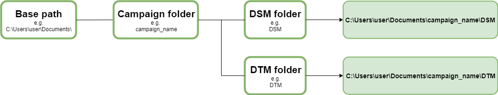
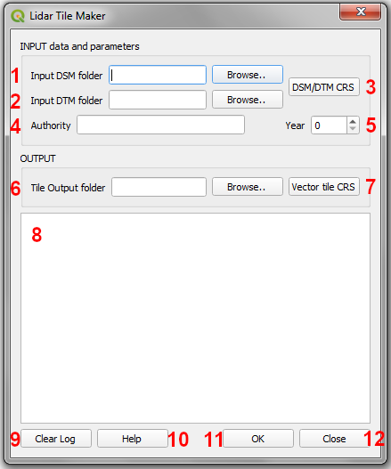
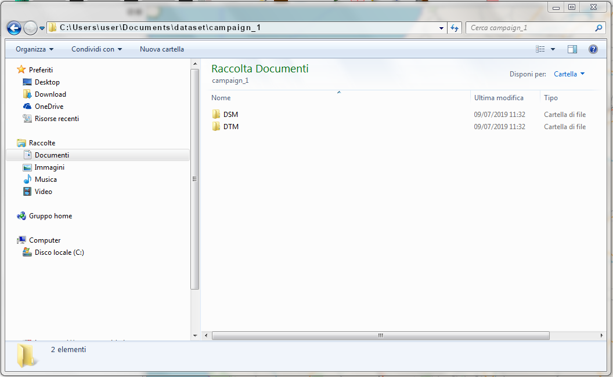
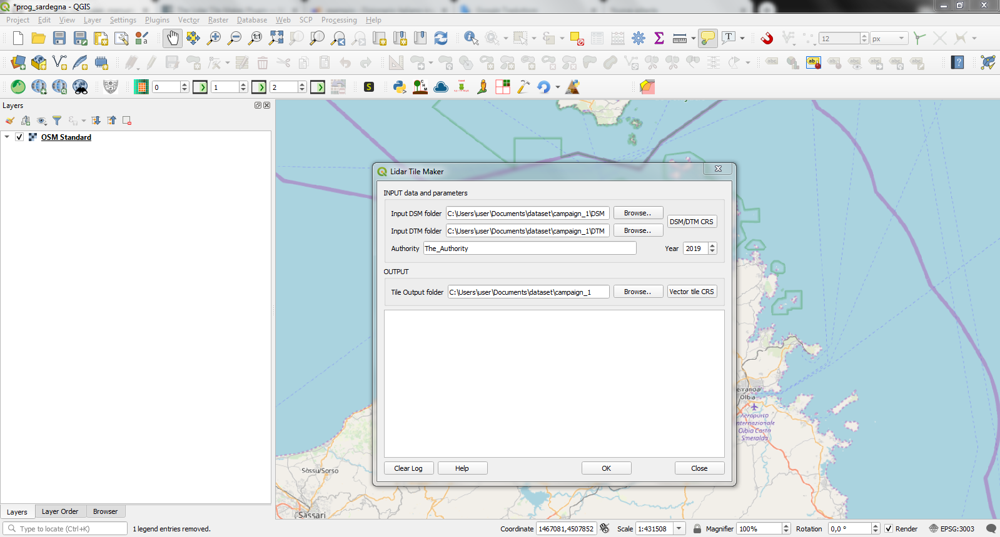
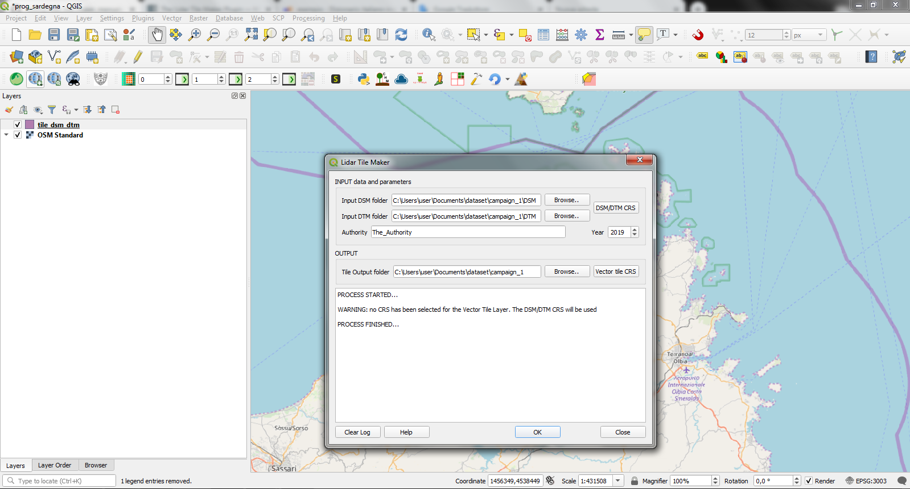
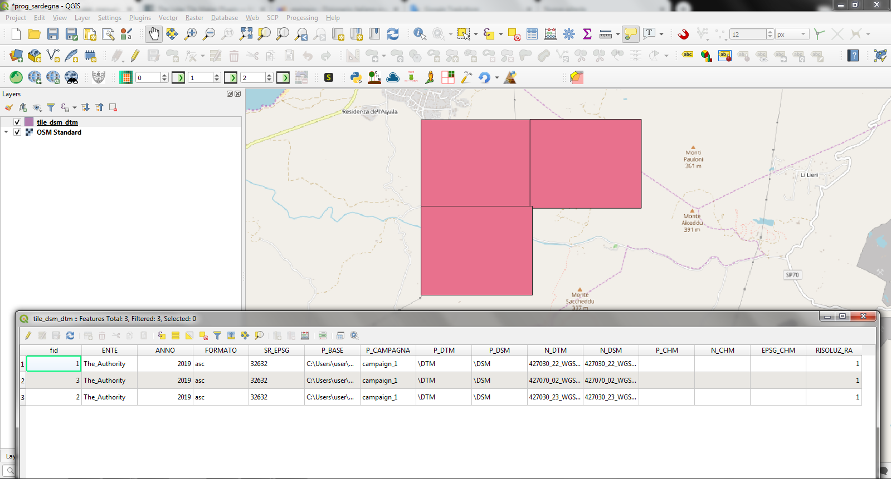

The Lidar Tile Maker Plugin
==================================
The **Lidar Tile Maker** Plugin creates the tile vector layer, named *tile_dsm_dtm*, to be used as input for the CHM from LIDAR Plugin. As already mentioned in the introduction of the manual, the CHM from LIDAR plugin automatically uploads and uses the *tile_dsm_dtm* vector layer, which contains data of Regione Veneto, but it can be replaced with the one created by the **Lidar Tile Maker** Plugin.
It creates a GeoPackage file, automatically named *tile_dsm_dtm.gpkg*, which contains the polygons of tiles computed from the extensions of the DTM/DSM file given by users as input. Also the related attribute table is automatically created with all the required fields and filled with all the necessary information taken from input parameters provided by users or from the data themselves. The fields of the attribute table of the *tile_dsm_dtm.gpkg* file are:

* ENTE - the authority given as input
* ANNO - the year given as input
* FORMATO - the format file of the DSM/DTM file, it is automatically taken from the DSM/DTM file stored in the folders given as input
* COMPRESSIO - this field is created only because it is used by the CHM from LIDAR plugin to check if input DSM/DTM file are compressed or not. By default the Lidar Tile Maker Plugin set the value of this field to 'no'. In fact the Lidar Tile Maker Plugin **works only with uncompressed file**. If the user wants to compress file (only .zip format is supported), it has to create a zip file for each DSM and DTM file and save the DSM zip file and the DTM zip file respectively in the DSM folder and in the DTM folder (see. section about Data Preparation.). The file compression has to be done after running the Lidar Tile Maker Plugin. Then the user has to manually edit the attribute table of the resulting *tile_dsm_dtm.gpkg* file changing the value of the COMPRESSIO field from 'no' to 'zip' for each row whose corresponding DSM/DTM file has been compressed.
* SR_EPSG - the EPSG code of the DSM/DTM CRS given as input
* P_BASE - the base path to the folder containing the DSM and DTM file (see section 'Data Preparation') taken from the DSM/DTM path given as input
* P_CAMPAGNA - the name of the folder of the flight campaign (see section 'Data Preparation') taken from the DSM/DTM path given as input
* P_DTM - the name of the folder containing the DTM file (see section 'Data Preparation') taken from the DTM path given as input
* P_DSM - the name of the folder containing the DSM file (see section 'Data Preparation') taken from the DSM path given as input
* N_DTM - the name of each DTM file automatically retrived from from the DTM path folder given as input
* N_DSM - the name of each DSM file automatically retrived from from the DSM path folder given as input
* P_CHM - this field will remain empty, it will be filled by the CHM from LIDAR Plugin with the path to the CHM file
* N_CHM - this field will remain empty, it will be filled by the CHM from LIDAR Plugin with the name of the CHM file
* EPSG_CHM - this field will remain empty, it will be filled by the CHM from LIDAR Plugin with the EPSG code of the CHM file CRS
* RISOLUZ_RA - the resolution of the DSM and DTM file automatically retrived by the DSM/DTM file themselves

All the values stored in the attribute table will be then used by the CHM from LIDAR plugin.

**NB. In order to use the tile_dsm_dtm.gpkg file as input for the CHM from LIDAR plugin, DO NOT rename the file and the Qgis layer and DO NOT delete or rename any field of the related attribute table.**

The DTM and DSM data deriving from a LIDAR flight campaign are divided into tiles. The **Lidar Tile Maker** Plugin computes the extension of each DTM tile and of its related DSM tile given as input. If the two tiles, DTM and related DSM, have the same extension, the plugin creates the tile polygon. The final output is a vector layer containing all the polygons corresponding to the extension of each tile DTM/DSM given as input. The plugin creates the corresponding tile polygon only if both DTM and DSM exist and if they have the same extension. Otherwise the tool returns a warning message.

The plugin works for a single LIDAR flight campaign. In case of several campaigns, the plugin has to be run for each campaign and it will create the corrisponding tile vector file. Then the tile vector layers have to be merged in order to obtain a single *tile_dsm_dtm.gpkg* file with all the tile polygons of each campaign to be used as input of the CHM from LIDAR plugin.

The main and mandatory input of the **Lidar Tile Maker** Plugin are:

* the folder containing all the DSM file of the desired campaign
* the folder containing all the DTM file of the desired campaign
* the Coordinates Reference System (CRS) of the DTM/DSM file
* an output path folder where the plugin will save the final tile_dsm_dtm.gpkg file

NB. The input DSM folder and the input DTM folder must belong to the same flight campaign.

NB. If a tile_dsm_dtm.gpkg file already exists in the provided output folder, it will be automatically overwritten.

Data Preparation
--------------------------------------------
Before running the **Lidar Tile Maker** Plugin, DSM and DTM data have to be organised in folders in order to allow the plugin to retrieve all the necessary information about the path of DSM and DTM data to be stored in the tile vector layer attribute table. This information will be then used by the CHM from LIDAR plugin to compute the CHM from the provided DSM and DTM.

All DSM data deriving from a certain flight campaign (e.g my_campaign) must be stored in a single folder with a certain name (e.g dsm_folder). In the same way, all DTM data deriving from the same campaign (e.g my_campaign) must be stored in a single folder with a certain name (e.g dtm_folder). Both the dsm_folder and the dtm_folder must be contained in another folder whose name should correspond with the one of the campaign (i.e. my_campaign). Obviously the campaign folder can be placed wherever (e.g C:\\Users\\user\\Documents\\whatever\\).

The path to the campaign folder (i.e. C:\\Users\\user\\Documents\\whatever\\) will be stored in the related field (named P_BASE) of the attribute table of the *tile_dsm_dtm.gpkg* file. The name of the campaign folder (i.e. my_campaign) will be stored in a specific field of the attribute table (named P_CAMPAGNA) while the name of the folder containing the DSM data (i.e. dsm_folder) and the name of the folder containing the DTM data (i.e. dtm_folder) will be stored in two different fields of the attribute table respectively named P_DSM and P_DTM. By joining the values of the three fields you will get the path to the DSM and DTM file. These paths combined with the DSM  and DTM file names, respectively stored in two fields of the attribute table (maned N_DSM and N_DTM), will be used by the CHM from LIDAR plugin to retrieve data from which compute the CHM.

Graphical User Interface
--------------------------------------------
All the required input parameters can be provided by users through the graphical user interface (GUI) of the **Lidar Tile Maker** Plugin that is shown pressing its icon in the toolbar.

* **1 - Input DSM folder:** select the folder containing all the DSM file of the desired campaign using the Browse button. Once selected, the path to the selected folder will be shown in the related line text widget. NB. If no input DSM folder is provided, the plugin will return an error message, the process will be stopped and the user will be able to provide the input DSM folder.
* **2 - Input DTM folder:** select the folder containing all the DTM file of the desired campaign using the Browse button. Once selected, the path to the selected folder will be shown in the related line text widget. NB. If no input DTM folder is provided, the plugin will return an error message, the process will be stopped and the user will be able to provide the input DTM folder.
* **3 - DSM/DTM CRS:** the button opens the Qgis CRS selector dialog and the CRS of the DSM/DTM file has to be selected. This parameter is mandatory, if no DSM/DTM CRS is provided, the plugin will return an error message, the process will be stopped and the user will be able to provide the DSM/DTM CRS. NB. Be careful to select the right CRS, otherwise the final result may be incorrect.
* **4 - Authority:** dgit the name of the authority which made the LIDAR survey in the line text widget. This information will be automatically stored in the related field of the attribute table. It is not mandatory but it is requested for using the *tile_dsm_dtm* layer as input of the CHM from LIDAR plugin.
* **5 - Year:** digit the year in which the LIDAR survey has been made. This information will be automatically stored in the related field of the attribute table. It is not mandatory but it is requested for using the *tile_dsm_dtm* layer as input of the CHM from LIDAR plugin.
* **6 - Tile Output folder:** select the folder in which the final *tile_dsm_dtm.gpkg* file will be saved using th Browse button. Once selected, the path to the selected folder will be shown in the related line text widget. NB. If no output folder is provided, the plugin will return an error message, the process will be stopped and the user will be able to provide the output folder. Be careful to not use spaces and/or special characters in th output folder name and path.
* **7 - Vector Tile CRS:** the button opens the Qgis CRS selector dialog and the CRS of the output vector tile can be selected. Unlike the DSM/DTM CRS, this paramete is not manadatory. If no vector tile CRS is selected the output *tile_dsm_dtm.gpkg* file will be created using the same CRS of the DSM/DTM.
* **8 - Log messages area:** all the warning and error messages will be shown in this text area during the process.
* **9 - Clear Log:** the button cleans the Log area removing messages related to a previous process.
* **10 - Help:** the button opens this manual in a web browser.
* **11- OK:** the button runs the process. As already mentioned, if the tool returns an error message the process will stop and the user will be able to provide or modify the input parameters, then the process will restart pressing again the OK button.
* **12 - Close:** the button closes the GUI and all the input parameters will be reinitialized.

Example
--------------------------------------------

DSM and DTM file are respectively stored in the folder named DSM and in the folder named DTM. The path to the DSM folder is 'C:\\Users\\user\\Documents\\dataset\\campaign_1\\DSM', where '*C:\\Users\\user\\Documents\\dataset\\*' is the base path that will be stored in the P_BASE field, '*campaign_1*' is the flight campaign folder and it will be stored in the P_CAMPAGNA field and '*\\DSM*' is the name of the folder containing the DSM file and it will be stored in the P_DSM field (in the same way for the DTM, P_BASE and P_CAMPAGNA will be obviously the same while the name of the folder containing the DTM file '*\\DTM*' will be stored in the P_DTM field).

Set input parameters from the **Lidar Tile Maker** Plugin GUI

Press 'OK' button

In this case no CRS for the Tile Vector Layer has been selected hence the plugin returns a warning message to advise user that the DSM/DTM CRS will be used for the *tile_dsm_dtm.gpkg* file

The final result is a vector layer named tile_dsm_dtm with the tile polygons corresponding to the extension of each DSM/DTM file found in the DSM and DTM folders given as input. The attribute table has been automatically filled with the values retrived from the input parameters and the file themselves.

**NB.** As already mentioned, the **Lidar Tile Maker** Plugin works for a single flight campaign. If you have several campaigns you have to run the plugin for each of them and then merge the obtained *tile_dsm_dtm.gpkg*. The output of the merge process must be a GeoPackage file named *tile_dsm_dtm.gpkg* and it can be used as input of the CHM from LIDAR plugin. Just load it in the working QGIS project befour pressing the icon of the the CHM from LIDAR plugin.
